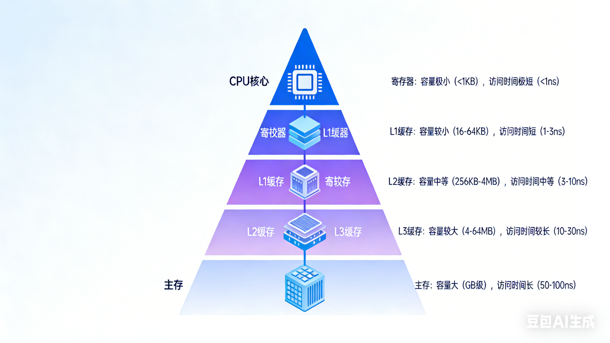
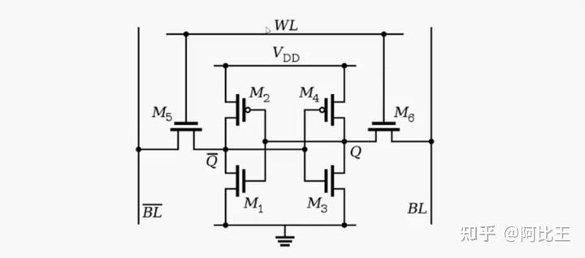
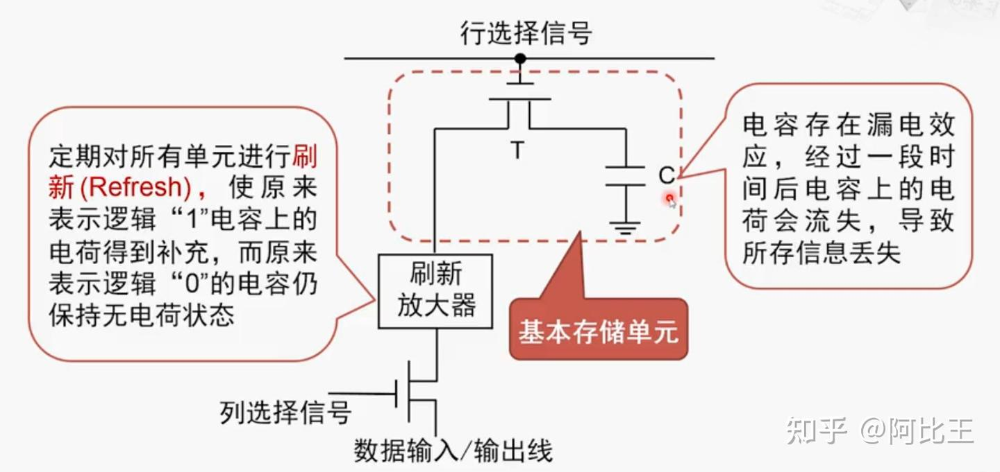
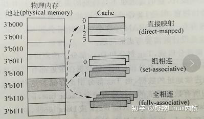

# 如何写出让 CPU 跑得更快的代码


## 🚀 引言：你以为的“快”，可能只是缓存的幻觉

> 你是否曾写过 O(1) 的算法，却跑得比 O(n) 还慢？
> 是否在 LeetCode 上 AC 了题目，上线后却被性能监控打脸？
> 真相很残酷：**现代 CPU 的速度，90% 取决于缓存，而不是你的算法复杂度。**  
>
> 内存延迟高达 100ns，而 L1 缓存只需 1ns——这意味着，**一次缓存未命中，等于浪费 100 个 CPU 周期！**
> 本文将带你深入 CPU 缓存的物理世界，揭秘数据如何被“聪明地”存放，并教你写出**真正高效**的代码——让 CPU 主动为你加速，而不是拖后腿。

------

## 🔧 优化后的提纲与内容框架

### 一、CPU 缓存 vs 主存：谁才是真正的“内存”？

- **存储层级金字塔**（Memory Hierarchy）：

  ​	

  - 寄存器 → L1 缓存（32–64KB，1ns）→ L2（256KB–1MB，3–10ns）→ L3（几 MB–几十 MB，10–40ns）→ 主存（DDR4/5，~100ns）

    

- **关键事实**：

  - 缓存集成在 CPU 芯片内，主存在主板上；
  - L1 分为 **指令缓存（I-Cache）** 和 **数据缓存（D-Cache）**；
  - L3 通常为多核共享，是缓存一致性的关键战场。

- **为什么不能全用 SRAM 做内存？**

  ​	sram 和 dram 结构如下

  ​	

  

  可以看出sram先比dram 成本高、密度低（1GB SRAM ≈ 100GB DRAM 体积+价格）

------

### 二、缓存如何组织数据？——从“块”到“行”的秘密

- **缓存行（Cache Line）**：  

  - 最小传输单位，通常 **64 字节**（x86/x64 架构）；
  - 即使你只读一个 `int`，CPU 也会加载其所在整行 64B。

- **映射方式：缓存如何决定数据该放在哪里？**

  CPU 缓存虽快，但容量有限。当从主存加载一个 64 字节的缓存行（Cache Line）时，**必须决定它应该被存放到缓存中的哪个位置**。这一决策机制，称为**映射策略（Mapping Policy）**。目前主流有三种方式，各自在速度、命中率和硬件成本之间做出不同权衡。

  

  **1. 直接映射（Direct Mapped）——简单粗暴，但易“撞车”**

  在直接映射中，**主存中的每个地址块只能映射到缓存中的唯一一个固定位置**。
  具体来说，通过地址的某些位（通常是中间的“索引位”）计算出它所属的缓存行号。

  - ✅ **优点**：硬件实现极其简单，查找速度极快（只需一次哈希定位）；
  - ❌ **缺点**：冲突率高。例如，若两个频繁访问的变量恰好映射到同一缓存行，它们会不断互相驱逐（cache thrashing），导致命中率暴跌。

  > 📌 **类比**：就像一栋公寓只允许每个门牌号对应一个固定房间——即使其他房间空着，你也只能住指定的那一间。

  **2. 组相联（N-Way Set Associative）——性能与成本的最佳平衡**

  这是现代 CPU 最广泛采用的方案（如 Intel/AMD 处理器的 L1/L2 缓存多为 8-way 或 16-way）。

  **Way（路）**：在组相联缓存中，**每个“组”（Set）内部包含的独立缓存行（Cache Line）的数量**，称为 “N-Way”，其中 N 就是 “Way”的数量。

  其核心思想是：**将缓存划分为若干“组”（Set），每组包含 N 个“路”（Way）**。
  主存中的任意一块数据，可以放入其对应组内的**任意一路**中。

  - ✅ **优点**：
    - 显著降低冲突概率（相比直接映射）；
    - 硬件复杂度可控（只需并行比较 N 个标签）；
    - 在命中率和访问延迟之间取得良好平衡。
  - ❌ **缺点**：比直接映射稍慢（需比较多个标签），但远优于全相联。

  > 📌 **举例**：L1 数据缓存常为 32KB、8-way 组相联、64B 行大小 → 共有 32×10248×64=648×6432×1024=64 个组。

  **3. 全相联（Fully Associative）——理想很丰满，现实很骨感**

  在全相联映射中，**主存中的任意一块数据可以存入缓存中的任意位置**。
  替换时，完全由替换算法（如 LRU）决定哪一行被踢出。

  - ✅ **优点**：理论命中率最高，无地址冲突问题；
  - ❌ **缺点**：
    - 硬件成本极高：每次访问需**并行比较所有缓存行的标签（Tag）**；
    - 随着缓存增大，比较电路规模爆炸式增长，功耗和延迟剧增。

  > 📌 **现实应用**：仅用于极小容量的缓存场景，如 TLB（Translation Lookaside Buffer）或某些嵌入式系统的微缓存。

  **总结对比**

  | 映射方式        | 命中率 | 访问速度 | 硬件复杂度 | 典型应用场景           |
  | :-------------- | :----- | :------- | :--------- | :--------------------- |
  | 直接映射        | 低     | ⚡ 极快   | 极低       | 早期 CPU、教学模型     |
  | 组相联（N-Way） | 中~高  | 快       | 中等       | **现代 L1/L2/L3 缓存** |
  | 全相联          | 最高   | 慢       | 极高       | TLB、极小专用缓存      |

  > 💡 **关键洞察**：没有“最好”的映射方式，只有“最合适”的设计。现代处理器通过**分层缓存 + 组相联**，在有限晶体管预算下榨取最大性能。

  

### **三、 缓存的“决策大脑”：替换策略与写策略**

CPU 缓存不仅是速度更快的存储，更是一套智能的数据管理机制。当缓存空间不足或数据被修改时，它必须做出关键决策：**该淘汰哪一行？修改后的数据何时写回内存？** 这些决策由两大核心策略驱动——**替换策略（Replacement Policy）** 与 **写策略（Write Policy）**，它们共同构成了缓存系统的“决策大脑”。

#### **替换策略：谁该被踢出去？**

- **替换策略**：**当缓存满了，谁该被踢出去？**

  CPU 缓存容量有限。当发生缓存未命中（Cache Miss）且目标组（Set）已满时，必须**选择一行数据驱逐（Evict）**，为新数据腾出空间。这一决策机制称为**替换策略**

  #### **✅ 主流方案：LRU 与近似 LRU**

  - **LRU（Least Recently Used，最近最少使用）**
    核心思想：**优先淘汰最久未被访问的缓存行**。
    理论上，LRU 能最大化利用时间局部性，在许多工作负载下接近最优命中率。
  - **现实限制**：
    精确实现 LRU 需要为每组维护一个完整的访问顺序链表或计数器，硬件开销随 Way 数呈平方级增长（例如 8-way 需记录 8! 种排列）。因此，现代 CPU 普遍采用**硬件友好的近似 LRU 算法**，如：
    - **Tree-PLRU**（Pseudo-LRU）：用二叉树结构记录访问方向，以少量比特模拟 LRU 行为；
    - **Clock 算法变种**：通过“引用位”轮询淘汰。

  > 📌 **关键点**：虽然不是严格 LRU，但这些近似方案在实际应用中表现优异，且成本可控。

#### **写策略**：**数据修改后，何时同步到内存？**

当程序写入数据时，缓存不仅要决定**是否存储该数据**，还要决定**何时将修改传播到下一级存储（通常是主存）**。这由**写策略**控制，主要有两种：

- Write-through（直写）

  **行为**：每次写操作**同时更新缓存和主存**。

  **优点**：

  - 数据一致性简单：内存始终是最新的；
  - 适合对可靠性要求极高的场景（如早期嵌入式系统）。

  **缺点**：

  - **性能差**：每次写都要穿透到慢速主存（~100ns），成为瓶颈；
  - 总线带宽浪费：频繁写同一地址会重复刷内存。

> ⚠️ **现状**：现代通用处理器**极少在 L1/L2 使用 Write-through**，仅可能用于特定 I/O 映射区域。

- Write-back（回写）：**——现代 CPU 的主流选择 ✅**

  **行为**：

  - 写操作**仅更新缓存行**；
  - 被修改的缓存行标记为 **Dirty（脏）**；
  - **只有当该行被替换出缓存时，才将 Dirty 数据写回主存**。

  **优点**：

  - **大幅减少内存写流量**：多次修改同一数据只需一次回写；
  - 提升带宽利用率，降低功耗；
  - 更好地匹配应用程序的写局部性（如循环累加）。

  **挑战**：

  - 需维护 **Dirty 位**（每个缓存行 1 bit）；
  - 多核环境下需配合**缓存一致性协议**（如 MESI）确保各核看到一致视图。

  > 💡 **现实应用**：
  > Intel/AMD 的 L1、L2、L3 缓存均采用 **Write-back + Write Allocate**（写未命中时先加载原数据再修改），这是高性能计算的基石。

------

### 四、写出缓存友好的代码：从“知道”到“做到”

> **原题优化理由**：“命中率更高”是目标，但程序员需要**具体可操作的技巧**。

#### ✅ 核心原则：**利用局部性（Locality）**

- **时间局部性**：刚访问的数据很可能再次被访问 → 重用变量；
- **空间局部性**：访问某地址，其邻近地址也可能被访问 → 顺序遍历优于随机跳转。

#### 🛠️ 实战技巧：

1. **遍历数组，别乱跳**  

   ```c
   // 好：行优先（C/C++/Go 默认）
   for (int i = 0; i < N; i++)
       for (int j = 0; j < M; j++)
           sum += A[i][j];  // 连续内存访问
   
   // 坏：列优先 → 缓存行浪费
   for (int j = 0; j < M; j++)
       for (int i = 0; i < N; i++)
           sum += A[i][j];  // 每次跳 N * sizeof(int) 字节
   ```

2. **结构体字段排序：把常用字段放一起**  

   **目标**：减少单个对象占用的缓存行数，并避免 False Sharing（伪共享）。

   #### **❌ 反面示例：字段分散 + 多线程竞争**

   ```cpp
   1// 坏：频繁访问的字段被冷数据隔开，且跨缓存行
   2struct BadCounter {
   3    int value;        // 线程 A 频繁修改
   4    char padding[60]; // 冷数据（或其它字段）
   5    int another_val;  // 线程 B 频繁修改
   6};
   ```

   - `value` 和 `another_val` 虽属不同逻辑单元，但若它们落在**同一个 64B 缓存行**中，
   - 当线程 A 修改 `value`，线程 B 所在核心的缓存行会因 MESI 协议被标记为 **Invalid**，
   - 导致线程 B 下次读 `another_val` 时发生缓存未命中——这就是 **False Sharing**。

   #### **✅ 正确做法：热字段集中 + 缓存行对齐**

   ```cpp
   1// 好：每个计数器独占一行，避免跨核干扰
   2struct alignas(64) HotCounter {
   3    int value;           // 高频访问
   4    int last_updated;    // 也常访问
   5    // 剩余 56 字节自动填充，确保不与其他对象共享缓存行
   6};
   7
   8// 使用示例
   9HotCounter counters[NUM_THREADS]; // 每个元素对齐到 64B 边界
   ```

   > 💡 提示：`alignas(64)` 是 C++11 标准属性，GCC/Clang/MSVC 均支持。

3. **避免指针 chasing（指针追逐）**  

   - 链表、树等非连续结构天然缓存不友好；

   - 考虑用 **数组 + 索引** 替代指针（如 Entity Component System）。

     #### **❌ 反面示例：传统链表遍历**

     ```cpp
     1struct ListNode {
     2    int data;
     3    ListNode* next;
     4};
     5
     6// 遍历时地址随机，每次可能触发缓存未命中
     7int sum = 0;
     8for (ListNode* p = head; p != nullptr; p = p->next) {
     9    sum += p->data;
     10}
     ```

     - 即使 `data` 很小，`next` 指针指向的节点可能散布在堆内存各处；
     - CPU 无法有效预取，L1/L2 缓存命中率极低。

     #### **✅ 优化方案：SoA（Structure of Arrays）或索引数组**

     ```cpp
     1// 方案1：SoA —— 数据连续存放
     2struct ListData {
     3    std::vector<int> values;      // 所有 data 连续
     4    std::vector<size_t> next_idx; // 用索引代替指针
     5};
     6
     7// 遍历：顺序访问 values，缓存友好
     8for (size_t i = 0; i != values.size(); ++i) {
     9    sum += values[i];
     10}
     11
     12// 方案2：ECS 风格（游戏引擎常用）
     13// 实体 ID → 组件数组索引，组件数组本身是连续的
     ```

     > 🎮 应用场景：游戏引擎（如 Unity DOTS）、高频交易订单簿、图计算。

4. **预取（Prefetching）与对齐**  

   - 编译器自动预取（如 GCC `-O3`）；

   - 手动对齐大结构体到缓存行边界（`alignas(64)`）。

     #### **✅ 示例 1：手动预取（适用于长循环）**

     ```cpp
     1#include <immintrin.h> // for _mm_prefetch
     2
     3const int N = 1000000;
     4std::vector<float> a(N), b(N), c(N);
     5
     6// 手动预取未来要用的数据（提前 ~200 字节）
     7for (int i = 0; i < N; ++i) {
     8    _mm_prefetch(&a[i + 64], _MM_HINT_T0); // 预取到 L1
     9    _mm_prefetch(&b[i + 64], _MM_HINT_T0);
     10    c[i] = a[i] * b[i];
     11}
     ```

     > ⚠️ 注意：过度预取会污染缓存，需实测调优。

     #### **✅ 示例 2：结构体对齐避免跨缓存行访问**

     ```cpp
     1// 坏：small_obj 可能与下一个对象共享缓存行
     2struct SmallObj {
     3    int id;
     4    float x, y;
     5}; // size = 12 bytes → 多个对象挤在同一行
     6
     7// 好：关键结构体对齐到缓存行
     8struct alignas(64) CriticalTask {
     9    uint64_t task_id;
     10    void (*handler)(void*);
     11    bool is_complete;
     12    // ... 其他字段
     13    // 总大小 ≤ 64B，且不会与邻居“打架”
     14};
     ```

5. **多线程下的 False Sharing 防御**  

   ```cpp
   struct alignas(64) Counter {
       int value;
   }; // 确保每个 Counter 占满一整行，避免跨核干扰
   ```
------

## 💡 结语：缓存不是魔法，而是可编程的资源

​	CPU 缓存不是黑盒——它是你可以**主动利用的性能杠杆**。
​	理解它的结构与行为，你就能写出**既简洁又极速**的代码。
​	下次当你优化性能时，先问一句：**“我的数据，在缓存里住得舒服吗？”**

缓存友好的代码 = 连续 + 对齐 + 局部 + 简洁

| 优化方向 | 数据缓存（D-Cache）                  | 指令缓存（I-Cache）                  |
| -------- | ------------------------------------ | ------------------------------------ |
| 核心原则 | 空间/时间局部性                      | 代码紧凑、跳转少                     |
| 典型技巧 | 数组遍历、结构体对齐                 | 内联、函数分组、减少虚调用           |
| 工具辅助 | `perf stat -e L1-dcache-load-misses` | `perf stat -e L1-icache-load-misses` |

拓展： 可以用 `perf` 或 `cachegrind` **（Valgrind 工具）**测量缓存命中率；